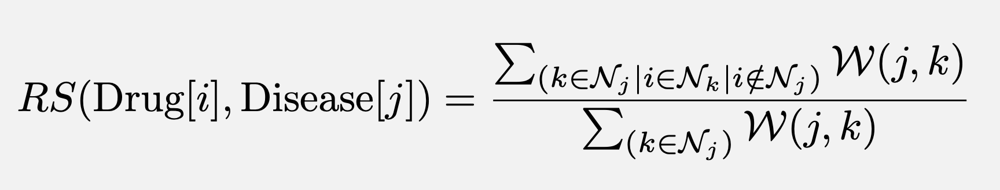
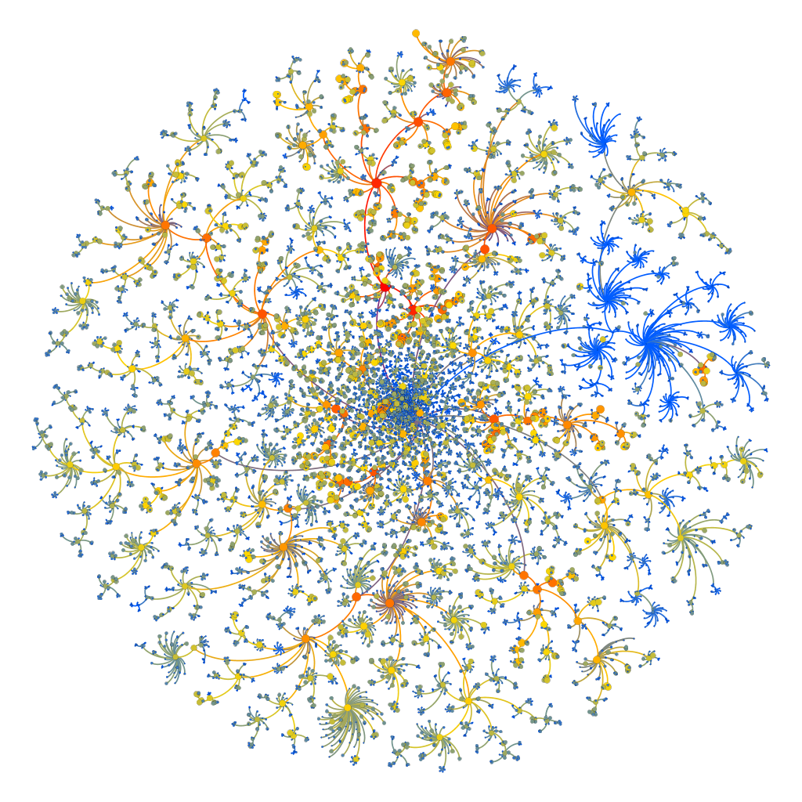

# March Virtual S2DS 2019 @ PIVIGO

## Team name
nLp-AttaCK

## Team members
	Luis Vela		vela.vela.luis@gmail.com
	Arun Narayanan		arunisnowhere@gmail.com
	Claire Chambers		chambers.claire@gmail.com
	Karsten Leonhardt	karlo1986@gmx.de
	
## Link to shared Google Drive folder
https://drive.google.com/drive/folders/1nHUJiPrvUruS4kLJrJSzfCdkm1UsYlwf

## Directory structure
	├── LICENSE
	├── README.md
	├── data (Google Drive)
	│	├── external       
	│	├── interim        
	│	├── final          
	│	└── raw            
	├── docs               
	├── notebooks          
	├── reports            
	│	└── figures        
	└── src                
		├── data           
		├── external       
		├── features       
		└── visualization 

## Company
AstraZeneca (https://www.astrazeneca.com/)

## Company description
AstraZeneca is a R&D pharmaceutical company with presence in research fields as varied as Cardiovascular, Respiratory, Autoimmune, Respiratory and Oncology. Their focus is mainly on disease and drug discovery.

## Company motivation
Reduce the cost of drug discovery. Either by using existing drugs on different diseases or automatizing the process of running Differential Gene Analysis on existing, publicly available, gene expression databases.

## Company objective
Automatize and scale the following processes:
- Data Access
- Data Exploration
- Data Clustering and Labeling
- Data visualization

## Project roadmap
Three stages make up the process:
- Programmatic access
- Automated methods
- Differential Expression Analysis

Our particular roadmap tackles the first two stages

## Concrete objectives   
- Data analysis of the GEO database
	+ Research trend analysis and forecast
	+ Drug recommendation
- Classification and labeling of genetic samples (Bonus)

## Raw resources
We have access to the RAW information contained in the GEO database. The Gene-Expression-Omnibus (GEO) is a large public repository of genomic data submitted by the scientific community where users can query and download gene-expression studies and profiles for many species. In our case, we are concerned in the homo-sapiens case. See links below:

https://www.ncbi.nlm.nih.gov/geo/info/overview.html
https://www.ncbi.nlm.nih.gov/geo/browse/?view=series
https://www.ncbi.nlm.nih.gov/geo/query/acc.cgi?acc=GSE117746
https://www.ncbi.nlm.nih.gov/geo/info/geo_paccess.html 

# PART 1 - Querying GEO and generating data
## Data for time series, drug recommendation and basic information of the sample clustering

To perform a flexible search query and download, tag and process the data, please execute the script:

`src/data/fetch_process_data.ipynb`

All required informations are given in the notebook.

## Supplemental data of the GEO samples
The above script fetches only the accession numbers and the titles of the GEO samples. However, this information is only sufficient for the clustering of the samples. To download the necessary data to classify the names of the samples after successful clustering, please execute the script

`src/data/fetch_sample_suppl_data.py`

which fetches supplemental informations of the samples such as characteristics of the channels, source name of the sample and description of the protocols, among others. The data will be downloaded into the folder

`data/interim/records_samples/samples_suppl/`

The data is consecutively downloaded and samples of about 10k are in each file `samples_suppl_k.pkl` and `samples_suppl_simple_k.pkl`, where k is an integer that labels the files consecutively. The `*simple*.pkl` files contain only the channel characteristics and the title of the samples and the rest contains more detailed informations of the samples.

Since there can be many samples to be downloaded, the script can continue to download where it previously stopped so that not the same data is downloaded again. A requirement for this is that you do not delete the already downloaded files in
	
`data/interim/records_samples/samples_suppl/`
	
Before you can execute this script, make sure you executed the notebook `notebooks/fetch_process_data.ipynb` beforehand, since the file `data/interim/records_samples/records.pkl` is required for execution.

# PART 2.1 - Drug Recommendation

The drug recommendation is constructed via execution of the two following notebooks:
	
- src/visualization/Disease_Drug_Graph.ipynb
- src/visualization/Draw_Hierarchy.ipynb

The first notebook constructs the disease-drug graph by constructing its nodes and edges. The nodes correspond to MeSH id’s while the edges are constructing according to the number of studies that cite both nodes simultaneously, weighted by number of samples in that study. 

The notebook later queries the graph to find possible drug recommendations for existing diseases as well as possible second-uses for existing drugs and ranks them according to a recommendation strength metric -RS- such that:
	
- In the case of a drug recommendation: RS corresponds to the weighted fraction of neighbors that use the new drug
- In in the case of a second-use recommendation: RS corresponds to the weighted fraction of neighbors treating the target disease.
- The specific formula used for the RS scored is shown below:

Where i,j and k are node indexes, N_i denotes the set of neighboring nodes of node(i), and W_ij denotes the weight of the edge connecting node(i) and node(j).

The second notebook is in charge of constructing the Hierarchical graph that depict the MeSH tree ID structure. It is based on the parent/daughter individual relations and the Count-attribute that roughly correspond to the number of counts that a topic is referenced throughout the corpus.

	
## Subpart 2.1.1: Disease_Drug_Graph.ipynb
	
### Imports
- NumPy
- Pandas
- matplotlib 
- NetworkX
 
### Input files (from GDrive)
- 'data/final/mesh.pkl'
- 'data/final/geo.pkl'
- 'data/final/geo_restful_chem.pkl'

### Logical procedure
After the imports have been made, and the input files have been properly read, the notebook then proceeds to execute the remaining cells. Roughly speaking, each cell corresponds to one or more of the following logical steps

#### Step1. 
Merge labels from geo.pkl and geo_restful_chem.pkl to take advantage of the more readable and more accurate tags for drug description that come from the restful API.

#### Step2. 
Calculate the category of each tag (Disease ‘C’ or Drug ‘D’. Calculate the depth in the hierarchical tree of each tagged disease/drug.

#### Step3. 
Filter entries by:
- Date
- Category
- Depth
- And manually exclude subcategory C23 (“Conditions, Signs and Symptoms”)

#### Step4. 
Construct node-list for future graph creation. The list ought to contain node_id, node_label and node_category.

#### Step5. 
Construct edge_list for future graph creation. The list ought to contain:
- Source (mesh_id)
- Target (mesh_id)
- Weight 

#### Step6. 
Construct the graph using the edge_list and load node attributes from node_list. Save as .pkl; Save as .gexf.

#### Step7. 
Select disease-only-subgraph. Run statistics:
- EigenCentrality
- PageRank
- Degree

#### Step8. 
Measure all recommendation scores for top-n nodes (according to the EigenCentrality metric). Rank them. 

#### Step9. 
Plot recommendation strength subgraph for a given cardinality using internal (limited) Network-X capabilities.

#### Step10. 
Repeat steps 7,8 and 9 for the drug-only subgraph to obtain a second-use recommendation for the most important drug-like nodes.

	
## Subpart 2.1.2: Draw_Hierarchy.ipynb

### Imports:
- Matplotlib.pyplot
- Pandas
- Numpy
- NetworkX 
- Pygraphviz

### Input files (from GDrive)
- ‘data/final/disease_tree_heading_count.csv
- 'data/final/disease_parent_treenumbers.csv'

### Logical procedure
Similarly, after importing the necessary libraries, and reading the input files into appropriate DataFrames, this notebook proceeds in the following logical fashion:

#### Step1. 
Gather edge information. Resulting dataframe must contain two fields:
- Source (Mesh_tree_id)
- Target (Mesh_tree_id)

#### Step2. 
Gather node information. Resulting dataframe must contain three fields
- Node_id (Mesh_tree_id)
- Node_label (Mesh Heading)
- Node_counts (Normalized number of counts)

#### Step3. 
Construct graph using edge_list and load node attributes from node_list. Save as .gexf.

#### Step4. 
Use NetworkX and Graphviz to construct a raw visualization of the hierarchical structure of the MeSH ontology. For raw visualization options iwithin NetworkX use:
	
	prog={‘sfdp’, ‘fdp’, ‘dot’, ‘twopi’, ‘neato’}.

## Subpart 2.1.3 - Graph Visualization with Gephi
Finally, after the .gexf files have been imported, one can use the open source graph-cisualization software GEPHI (https://gephi.org/) to create tailored visualizations of the graphs, subgraphs or filtered version of them. Some of the gephi images (.png and .svg) obtained for our presentation, the original (.gexf) files and the gephi-project files (.gephi) have been added to this repo under the following subfolder: 
	
	'/reports/figures/Graph'

## Subpart 2.1.4. Results

### Disease-Drug graph for top-N nodes only
Using gephi, we can construct a subgraph by filtering out all the edges whose normalized weight is small. The resulting subgraph can be filtered again based on the Degree of the remaining nodes. In this way we can get a clean image of the most relevant disease/drug nodes present in out graph. The results are shown in the graph below where the green nodes correspond to diseases and the blue nodes correspond to drugs.

### Drug recommendation for a specific disease
Similarly, we can obtain a subgraph containing a specific disease (in our case "Pancreatic Disesease") in blue, all its neighboring diseases in green, and finally, in red, a node corresponding to the drug "Disparate Innate Cytokine". We can see how the RS-score for this particular case is equal to 1.00 since all the green nodes are connected to the red drug but our target disease, in blue, is not.

### MeSH Hierachy Tree

Using Gephi, the underlying tree hierarchy of the Mesh_Tree_id categories can be mapped intoa  single tree-entity. This entity can be represented as a directed graph with the edges direction always pointing from the parent node (category) to its daughter nodes (subcategories). The resulting image is shown below:

As opposed to the picture in the header of this README.md file, the above tree structure has all the categories of the tree. All levels and all depths are displayed here. The color of the nodes corresponds to the Counts that each category has based on the numebr of times it appears in a summary.

### RS-score limitations: The 1-neighbor cases
As an example of the bias that exists within the RS-score, we can see in the following graphs (Not generated with Gephi, but with NetworkX internal library) a few examples of cases where the RS score comes out as 1.00, but the neighbors connecting the target disease, and the recommended drug is very little (equal to 1). The examples in the lower row, although more relevant from a statistical point of view, come out with a lower RS score.

# PART 2.2 - Descriptive Analysis and Time Series Analysis

### Pie chart of main disease types in GEO (MeSH tree: level 1) 

## Notebooks:
`src/features/filter_geo.ipynb` 
`src/features/get_counts_with_descendents.ipynb` 
`src/features/generate_time_series.ipynb` 
`src/visualization/vis_time_series.ipynb` 
`src/visualization/arima.ipynb` 
## Inputs:
`data/final/geo.pkl` 
`data/final/mesh.pkl` 
## Modules to install:
`Pandas, Numpy, os, Seaborn, Matplotlib, statsmodels, sklearn, copy`
## Steps:
Generate data in parts 2.2.1-2.2.3 
Then visualize in 2.2.4-2.2.5 

### Subpart 2.2.1: filter_geo.ipynb
Filter `geo.pkl`, the data frame containing disease and drug tags, so that disease tags uniquely belong to only the disease category. This excludes categories which are not diseases, like 'Animal models of disease' 
Run: `src/features/filter_geo.ipynb` 
Output: `data/final/geo_filtered.pkl`

### Subpart 2.2.2: get_counts_with_descendents.ipynb
Get counts for each disease, for ranking diseases by how studied they are in the GEO data base. This outputs counts of each category and their descendents in the MeSH tree (e.g. the category 'neoplasms' includes counts for all the subtypes of neoplasm, e.g. 'lung neoplasm', 'carcinoma', etc.) 
Run: `src/features/get_counts_with_descendents` 
Output: `data/final/meshids_rankedby_NSeries.pkl`

### Subpart 2.2.3: generate_time_series.ipynb
Generate time series data: Generates data frames with sample and study counts over time 
Run: `src/features/generate_time_series` 
Output: 
`data/final/samplesbyyear_for_plotting.pkl`  
`data/final/top_diseases_for_plotting.pkl` 
`data/final/countsbyyear_for_plotting.pkl`

### Subpart 2.2.4: vis_time_series.ipynb
Generate descriptive and time series plots: Pie chart of main disease categories, Plot time series of sample counts for main categories and subcategories, Area plot for main categories, Area plot for selected subcategory, time series of chemicals studied in conjunction with specified disease 
Run: `src/visualization/vis_time_series.ipynb` 
Output visualizations folder: `/reports/figures/desc` 

### Time series of main disease categories (normalised sample counts, MeSH tree: level 1) 

### Time series of chemicals studied in conjunction with carcinoma (raw study counts) 

### Subpart 2.2.5: arima.ipynb

Uses time series data generated in (3.) to train ARIMA model, compute error on test set, generate predictions for future (+n years), plot future predictions 
	
Run: `src/visualization/arima.ipynb` 
Output visualizations folder: `/reports/figures/desc` 

# PART 3 - Sample Classification (Bonus)
Objective: to label sample titles per study into control vs. non-control or healthy vs. diseased. 

There are more than 45000 studies and more than 2 million samples. 

Examples of sample titles: 
Study 1: MM253 24 h TPA, LSPM2 Control, LSPM2 Control Recovery 
Study 2: 3AMH02030706_Liver, MGMH030312023Aovary, 3AJZ02053105_SmoothMuscle 
Study 3: NHGRI_CRL-1634, NHGRI_UACC-457, MM127 Control, NHGRI_M93-047, NHGRI_NilC 
 
The following two methods were used: (1) heuristic string matching and (2) clustering. 

### Input files (from GDrive)
- 'data/final/samples.pkl'

## Subpart 3.1: Labeling samples using _string_matching_heuristic_
Use a vocabulary, i.e., a predefined list. For example, Control = ['healthy', 'control', 'not infected', 'normal']. 
 
Compare the sample titles with this vocabulary by 
(1) Exact string matching 
(2) Fuzzy string matching 

Uses `samples.pkl` as input data. 
Run: `src/clustering/samples_string_matching_heuristic.ipynb` 

Around 20% to 25% of the studies could be classified in this manner. 

## Subpart 3.2: Labeling samples using clustering method
Use a clustering method (Affinity propagation with Levenshtein distance) to cluster the sample titles. 
Use a labeling method (longest common substring) to assign labels to the clusters. 

Uses `samples.pkl` as input data. 
Run: `src/clustering/samples_clustering.ipynb` 

The notebook shows examples of the clustering and labeling, including successful and problematic labeling. 
Problems with the method and potential improvements are also mentioned.
